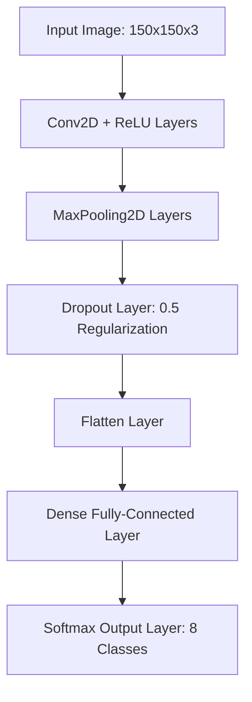

# 📸 Natural Image Classification using CNN

A high-performance Deep Learning computer vision system utilizing a custom Convolutional Neural Network (CNN) architecture to classify natural images into 8 distinct categorical classes.

[](https://www.tensorflow.org/)
[](https://www.python.org/)
[]()
[]()
[](https://opensource.org/licenses/MIT)

---

## 📌 Project Overview

This repository features an end-to-end **Deep Learning image classification pipeline**. Built using the TensorFlow and Keras ecosystems, the model executes localized feature extraction across various natural image categories. 

The scope of this project encompasses the entire lifecycle of computer vision engineering—ranging from raw data subset partitioning and stochastic image augmentation to model performance evaluation and multi-platform model deployment exports.

---

## 🎯 Project Objectives

- **Custom CNN Engineering:** Design and train a multi-layer Convolutional Neural Network from scratch.
- **Data Augmentation:** Implement real-time pixel transformations to increase dataset variance and eliminate overfitting.
- **Comprehensive Evaluation:** Track loss convergences and prediction accuracy thresholds across hidden validation frames.
- **Cross-Platform Exporting:** Compile and convert trained weight parameters into deployment-ready formats for Web and Mobile hardware.

---

## 📝 Dataset & Partition Schema

The core engine is trained on the **Natural Images Dataset**, consisting of 8 highly diverse, balanced target classes:

* ✈️ **Airplane**
* 🚗 **Car**
* 🐱 **Cat**
* 🐶 **Dog**
* 🌸 **Flower**
* 🍎 **Fruit**
* 🏍️ **Motorbike**
* 👤 **Person**

### 📊 Data Pipeline Partition
To guarantee strict evaluation unbiased by data leakage, the dataset was deterministically divided via `split-folders` into the following allocation matrices:
- 📈 **80% Training Frame:** Used directly for model parameter optimization.
- 📉 **10% Validation Frame:** Leveraged during cross-epoch tuning hyperparameter checkpoints.
- 🎯 **10% Test Frame:** Absolute unseen data used for final model grading.

---

## 🏗️ Model Architecture Pipeline

The network topology utilizes consecutive convolutional filtering layers to automatically extract contextual image textures and spatial relationships:



1. **Feature Extraction Layer:** Alternating `Conv2D` filters capture primitive shapes, while `MaxPooling2D` windows downsample spatial size.
2. **Regularization Layer:** A `Dropout (0.5)` node architecture deactivates half the neurons per batch to enforce general feature abstraction.
3. **Classification Head:** The matrix is flattened and piped into a `Softmax` output matrix layer representing probabilities across the 8 target classes.

---

## ⚙️ Preprocessing & Real-Time Augmentation

To simulate variable real-world captures, data streams undergo a randomized data augmentation pipeline within the `ImageDataGenerator` framework:
- **Pixel Standardization:** Pixel values are rescaled from `[0-255]` to a floating `[0-1]` range boundary.
- **Spatial Mutations:** Applies dynamic `rotation_range`, `horizontal_flip`, and `shear_range` boundaries.
- **Dimension Unification:** Enforces uniform image target resizing to **150x150 pixels**.

---

## 📊 Evaluation & Operational Metrics

The convolutional architecture maintains strong model generalized accuracy thresholds across unseen datasets:
- ✅ **Validation Dataset Accuracy:** `> 85%`
- ✅ **Unseen Testing Dataset Accuracy:** `> 85%`

*Detailed training history plots documenting cross-epoch categorical cross-entropy loss drops and accuracy scaling tracks are fully recorded and accessible within the source notebook file.*

---

## 🚀 Cross-Platform Deployment Readiness

The operational model structures were compiled and serialized into multiple production formats to support edge-device integrations:
- 📁 **TensorFlow SavedModel:** Optimized for core native Python server execution.
- 📱 **TensorFlow Lite (.tflite):** Quantized compilation for mobile device deployment hardware.
- 🌐 **TensorFlow.js (TFJS):** Sharded client-side runtime model format for in-browser client predictions.

---

## 📂 Project Structure

```bash
natural-image-classification/
├── saved_model/         # Production TensorFlow SavedModel binaries
├── tflite/              # Highly compressed mobile-ready runtime assets
├── tfjs_model/          # Web-sharded JS binary graph arrays
├── requirements.txt     # Python library environment dependencies
├── proyek_akhir.ipynb   # Main technical prototyping notebook
└── README.md            # Technical documentation
```

---

## 🛠️ Tech Stack & Tooling

- **Language:** Python 3.x
- **Deep Learning Framework:** TensorFlow 2.x / Keras
- **Scientific Matrices:** NumPy, Scikit-learn
- **Visualization:** Matplotlib
- **Prototyping Environment:** Google Colab / Jupyter Notebooks

---

## ▶️ Execution Guidelines

### 1. Clone the Architecture
```bash
git clone https://github.com/imammularif/natural-image-classification.git
cd natural-image-classification
```

### 2. Configure Local Environment
```bash
pip install -r requirements.txt
```

### 3. Initialize Notebook
Launch `proyek_akhir.ipynb` inside **Google Colab** or your local **Jupyter Notebook** environment to execute or retrain the training pipeline.

---

## 🚀 Future Roadmap Improvements

- Implement **Transfer Learning** using pre-trained neural networks (e.g., MobileNetV3 or ResNet50) to boost performance.
- Embed interactive **Confusion Matrix** mappings to dissect inter-class classification failures (e.g., Cat vs. Dog variances).
- Develop a containerized web dashboard for direct user image drag-and-drop inference testing.

---

## 👨‍💻 Author
- Imammul Arif
-📍 Indonesia
- 🔗 LinkedIn: https://linkedin.com/in/imammularif
- 🔗 GitHub: https://github.com/imammularif
